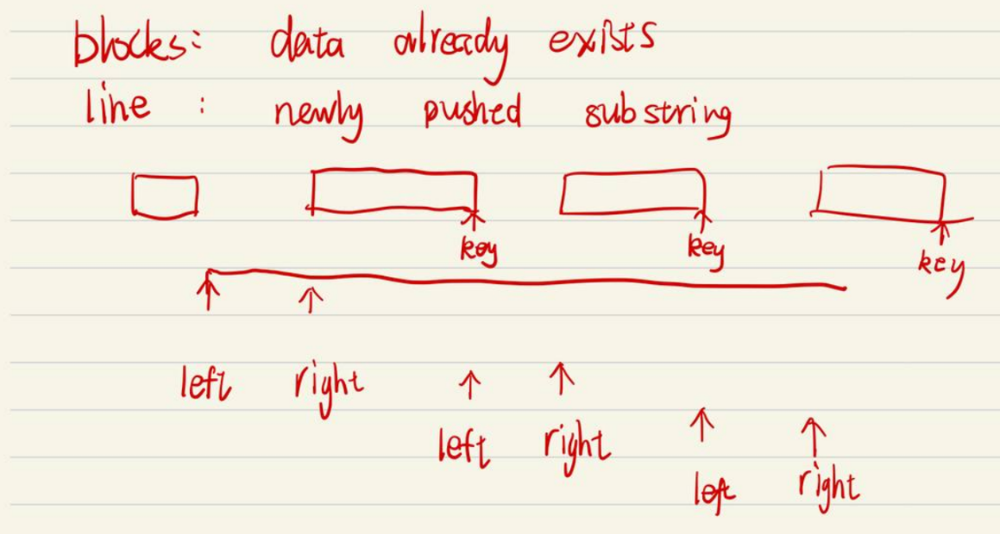
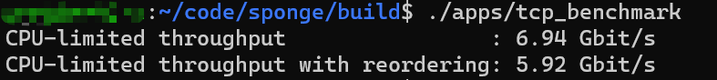
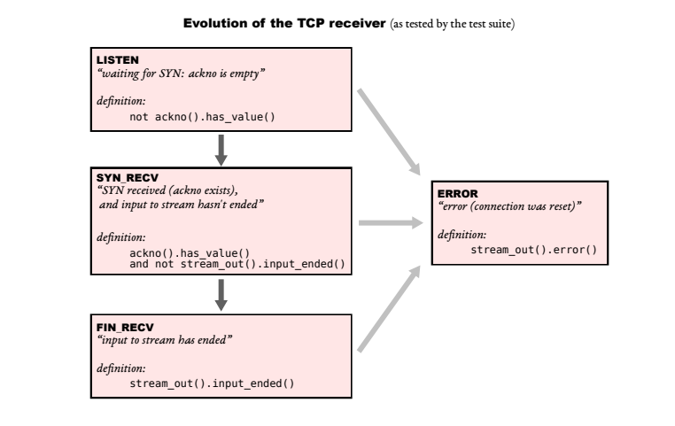
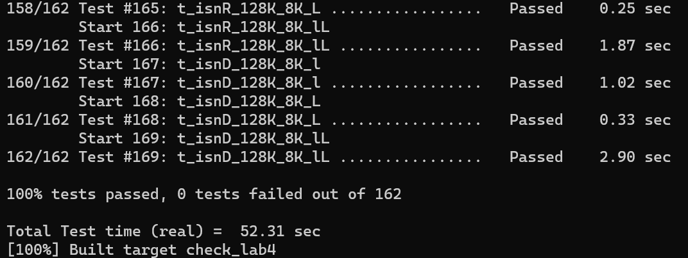

## My Implementation Notes

> tips: use cerr to print debug message

### Lab0 ByteStream
- my first implementation used a vector&lt;char> to store bytes, like a cicular queue: beg always points to the first position, and end points to the position next last byte. beg==end means buffer empty and (end+1)%_cap means buffer full. It turns out this is not very efficient. When I firstly finish lab4, the benchmark shows its throughput is 0.13 Gits.
- to improve performance, I change the buffer implements to std::string, this implementation is simple but efficient. If the input string beyonds capacity, use substr to cut the suitable substring, and append it to the buffer. For buffer reads, just return buffer.substr(0,len) and erase them. After switching to this, the throughput increases a bit but still less than 0.5 Gbit/s. The biggest improvement is from Stream_reassembler, I'll explain it then.

### Lab1 Stream Reassembler
- The first implementation that came to my mind is using a vector<char> to store bytes and another vector<bool> to indicate which byte is valid. Very intuitive and its code is easy to write. However, when I finished lab4 and look back, this trivial stream reassembler causes performance bottlenecks.
- To effectively assemble bytes segment, I considered several data structures. The first one is heap(priority_queue), if I put the leftmost segment on the top of heap, after every push_string(), put the data_string into heap and continuously pop the top segments with index==stream_out.bytes_written(). But it turns out it's hard to deal with data overlap. 
- So I turn to use std::map. The basic idea is only put non-overlapping byte segments into the buffer map. If all segments in buffer are already non-overlapping, all you need to do is find which substring is not in the buffer. Use the **right most** index of a segment as the map key. Every iteration, look up the first key in map which is bigger than the left index, because this is the only possible overlapping segment with substring[left, ...], let right = min(substr_right_index, segment_in_map_left_index), push substr[left,right] into buffer and set next left = key. After buffer map insertion, just pick the buffer.begin() and write it into stream_out if it's index==bytes_read, repeat this until buffer is empty or the first index is larger than stream_out.bytes_written.

- The std::map implementation is much efficient than the vector one, and the throughput soared a lot:
- 

### Lab2 TCP Receiver
- The lab instruction shows a picture about evolution of the TCP receiver state.
- 
- To eventually pass lab4, it's important to be careful about those states because lab2 tests will not test all situation. For example, if receiver is in LISTEN state, it should discard all packets without SYN flag.

### Lab3 TCPSender
- This can be done in two steps. First, implement the package sender, then, add a tick timer.
- fill_window should produce packets only if window_size available(window-bytes_in_flight) is not zero and there is something to send(SYN/data/FIN).
- the retransmission data structure could be a queue, push every segment into it and delete from front when the front segment is ACKed.
> since tests for lab2/lab3 are not full-coverage, I checked my code by put my code files into someone else's code and run check_lab4 to test my code's correctness.

### Lab4 TCP Connection
- If your previous code is not reliable, this lab may be very nasty. But if they are robust, as the instruction says, lab4 only combines your TCPSender and TCPReceiver and handle the overall issues for a full TCP connection.
- For me, the most difficult part is handle "cleanly finish". Strictly follow the lab instruction, check the 4 prerequisite for cleanly finish.
- Tests should be run on CS144VM environment, otherwise there may be some unpredictable problems.
- 
- Once you pass the check_lab4 tests,try the tcp_benchmark. you can revise your previous labs for better performance.

### Lab5 #TBD

---
For build prereqs, see [the CS144 VM setup instructions](https://web.stanford.edu/class/cs144/vm_howto).

## Sponge quickstart

To set up your build directory:

	$ mkdir -p <path/to/sponge>/build
	$ cd <path/to/sponge>/build
	$ cmake ..

**Note:** all further commands listed below should be run from the `build` dir.

To build:

    $ make

You can use the `-j` switch to build in parallel, e.g.,

    $ make -j$(nproc)

To test (after building; make sure you've got the [build prereqs](https://web.stanford.edu/class/cs144/vm_howto) installed!)

    $ make check_labN *(replacing N with a checkpoint number)*

The first time you run `make check_lab...`, it will run `sudo` to configure two
[TUN](https://www.kernel.org/doc/Documentation/networking/tuntap.txt) devices for use during
testing.

### build options

You can specify a different compiler when you run cmake:

    $ CC=clang CXX=clang++ cmake ..

You can also specify `CLANG_TIDY=` or `CLANG_FORMAT=` (see "other useful targets", below).

Sponge's build system supports several different build targets. By default, cmake chooses the `Release`
target, which enables the usual optimizations. The `Debug` target enables debugging and reduces the
level of optimization. To choose the `Debug` target:

    $ cmake .. -DCMAKE_BUILD_TYPE=Debug

The following targets are supported:

- `Release` - optimizations
- `Debug` - debug symbols and `-Og`
- `RelASan` - release build with [ASan](https://en.wikipedia.org/wiki/AddressSanitizer) and
  [UBSan](https://developers.redhat.com/blog/2014/10/16/gcc-undefined-behavior-sanitizer-ubsan/)
- `RelTSan` - release build with
  [ThreadSan](https://developer.mozilla.org/en-US/docs/Mozilla/Projects/Thread_Sanitizer)
- `DebugASan` - debug build with ASan and UBSan
- `DebugTSan` - debug build with ThreadSan

Of course, you can combine all of the above, e.g.,

    $ CLANG_TIDY=clang-tidy-6.0 CXX=clang++-6.0 .. -DCMAKE_BUILD_TYPE=Debug

**Note:** if you want to change `CC`, `CXX`, `CLANG_TIDY`, or `CLANG_FORMAT`, you need to remove
`build/CMakeCache.txt` and re-run cmake. (This isn't necessary for `CMAKE_BUILD_TYPE`.)

### other useful targets

To generate documentation (you'll need `doxygen`; output will be in `build/doc/`):

    $ make doc

To format (you'll need `clang-format`):

    $ make format

To see all available targets,

    $ make help
